<div align="center">

# Hyprism

**Dotfiles automatizados para um ambiente Hyprland pessoal, coeso e dinâmico.**

[](https://archlinux.org/)
[](https://hypr.land/)
[](https://quickshell.org/)
[](https://github.com/InioX/matugen)

</div>

> Hyprism é um conjunto de dotfiles automatizados para uma experiência personalizada no Hyprland. Quickshell fornece a ilha, os painéis e os widgets; Matugen propaga as cores do wallpaper por toda a sessão.

## Demonstração

[](assets/demo/hyprism-tour.mp4)

| Desktop e ilha compacta | Ilha expandida |
| --- | --- |
| 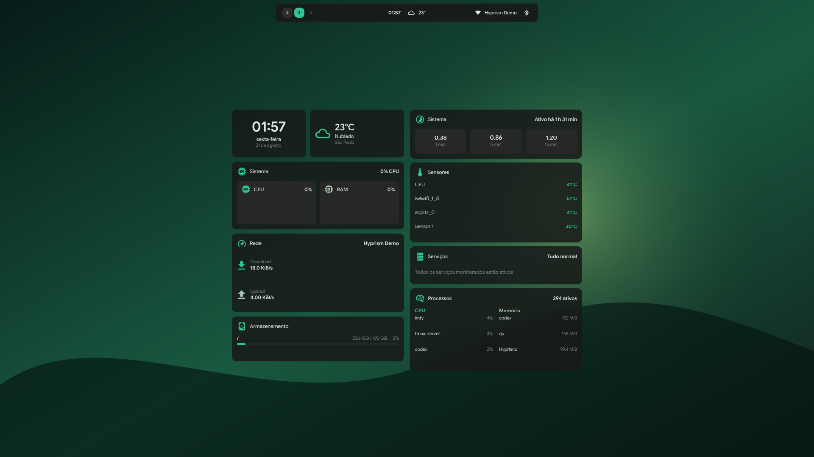 | 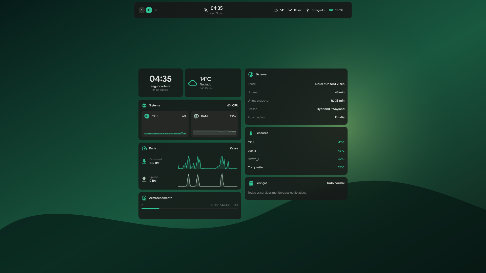 |
| **Widgets do desktop** | **Launcher** |
| 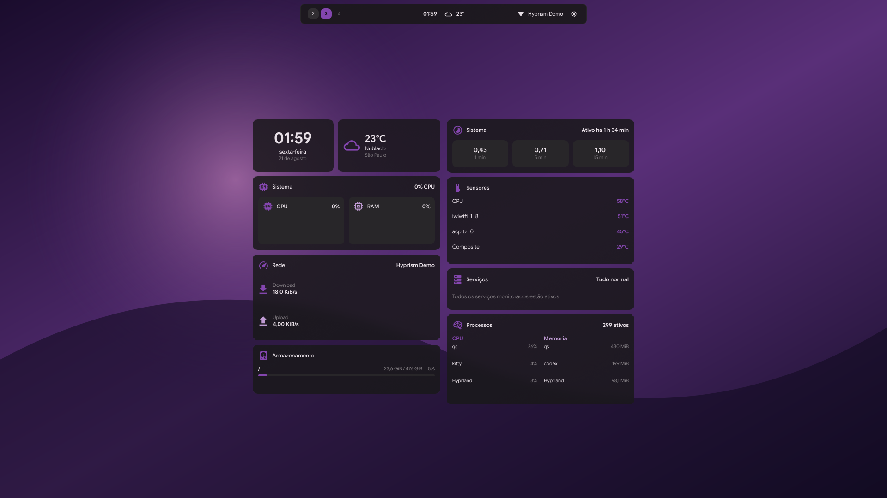 | 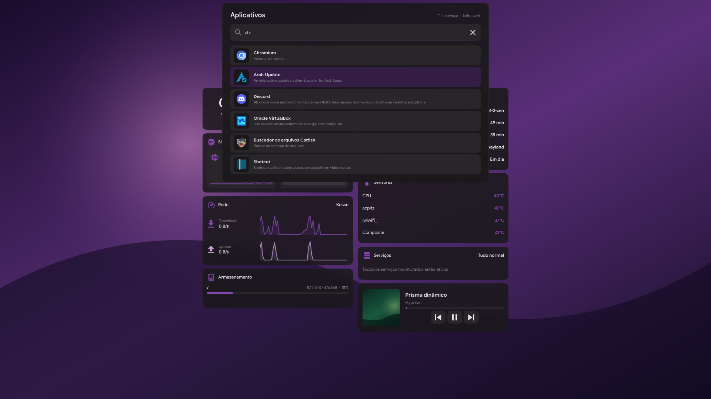 |
| **Central de controle** | **Histórico de notificações** |
| 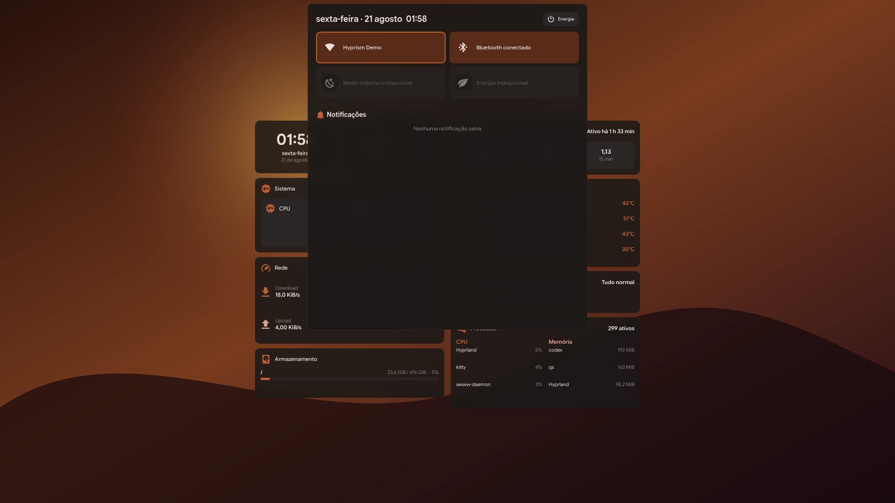 | 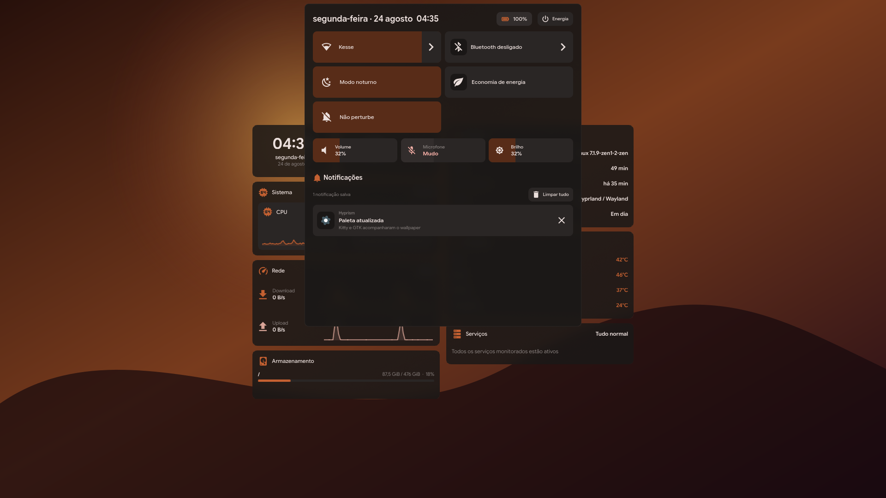 |
| **Rede** | **Bluetooth** |
| 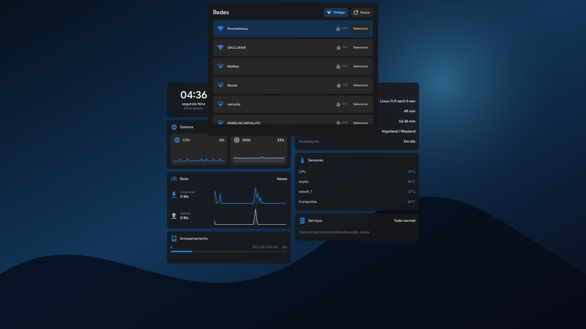 | 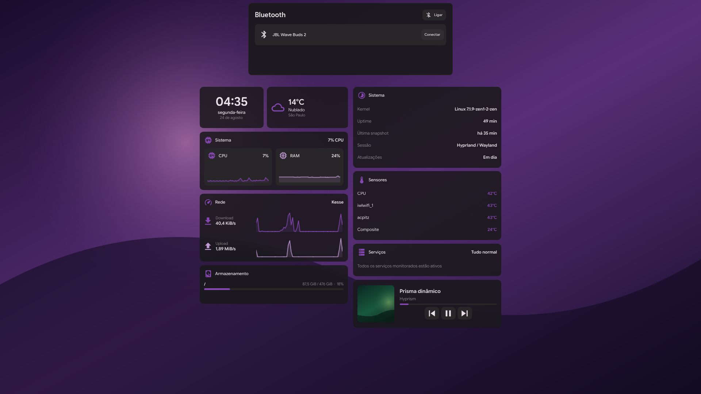 |
| **Área de transferência** | **Seletor de emoji** |
| 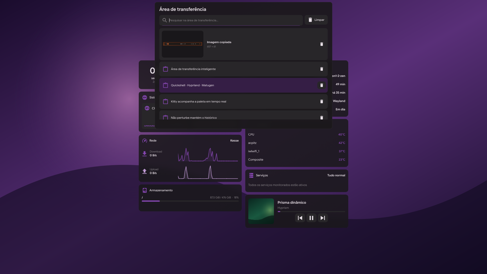 | 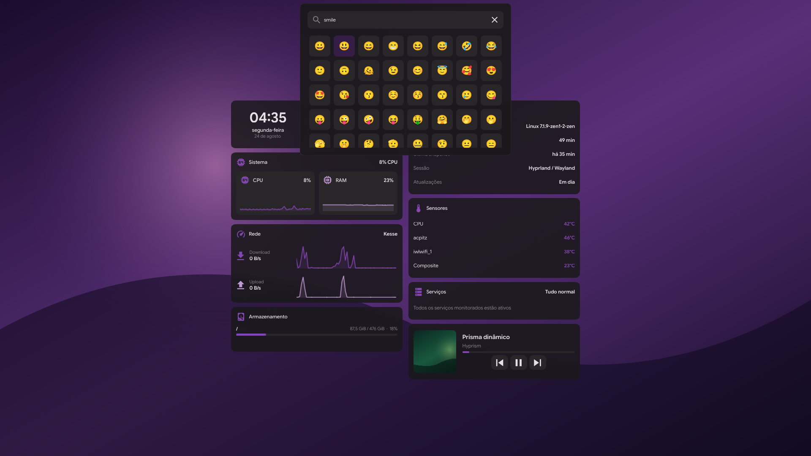 |
| **Energia** | **Gravação** |
| 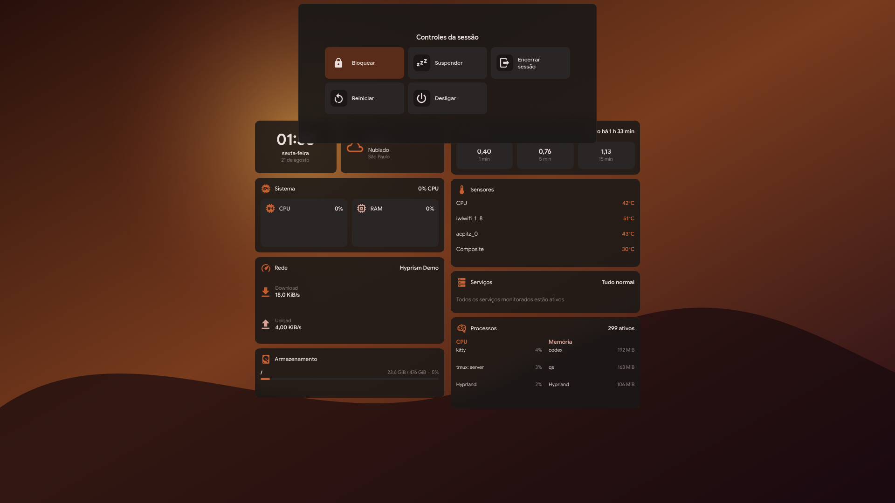 | 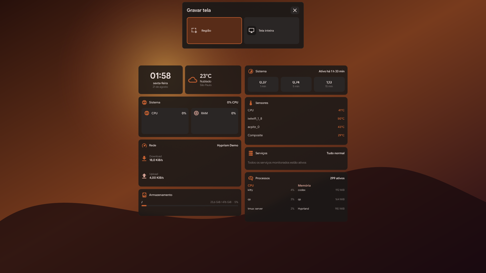 |
| **Papéis de parede** | **Troca de janelas** |
| 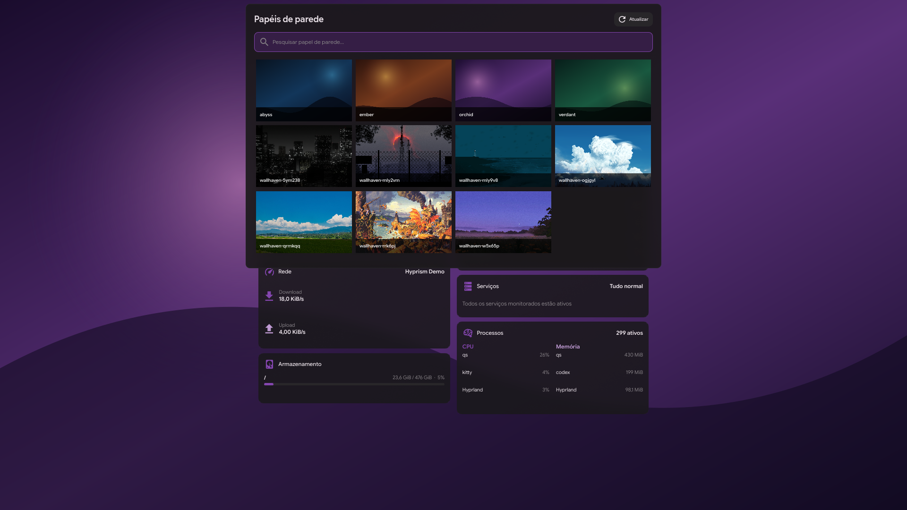 | 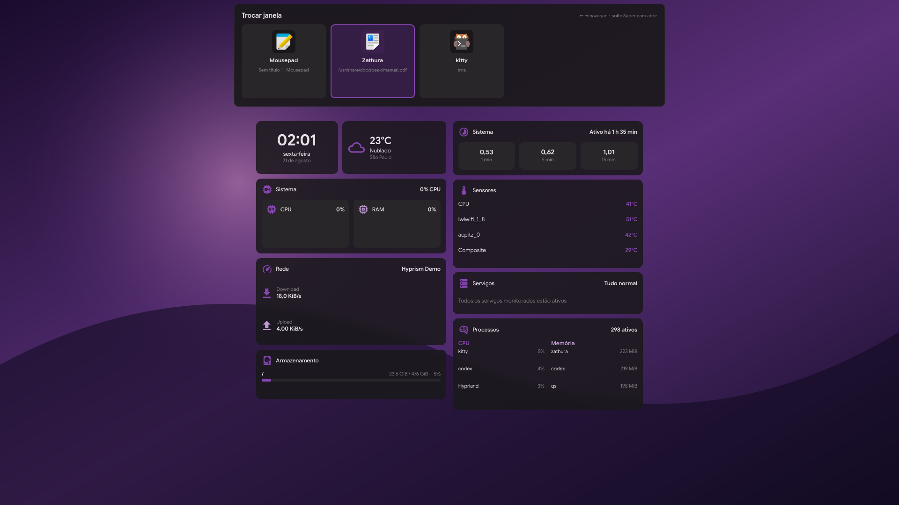 |

## O que configura

- Hyprland em Lua: monitores, workspaces, gestos, regras, ambiente, atalhos e autostart.
- Quickshell: ilha morfológica, launcher, troca de janelas, controles, notificações, OSD e widgets de monitoramento.
- Temas Matugen para Hyprland, Hyprlock, SDDM, GTK, Kvantum, Kitty, Foot, Starship, tmux, Neovim, Fastfetch e Zathura.
- Índice de aplicativos nativos e Flatpak com atualização ao vivo, além de portais Wayland integrados.
- Capturas, gravação de região ou monitor, clipboard, modo noturno e controles de áudio, brilho, rede e Bluetooth.

## Requisitos

- Arch Linux com acesso à internet durante o provisionamento.
- Um usuário normal com `sudo`; o instalador precisa de root para pacotes, fontes e SDDM.
- Hardware e drivers compatíveis com uma sessão Hyprland/Wayland atual.

## Instalação

```bash
git clone https://github.com/kristyancarvalho/hyprism.git
cd hyprism
sudo ./install.sh --user "$USER"
```

> [!WARNING]
> A instalação atualiza pacotes e substitui configurações gerenciadas do usuário. Conflitos são movidos para `~/.local/state/hyprism/backups/` antes da criação dos links.

Para reaplicar apenas os arquivos depois que todas as dependências já estiverem instaladas:

```bash
sudo ./install.sh --user "$USER" --no-packages
```

Os wallpapers ficam em `~/Imagens/Wallpapers`. Para aplicar um arquivo pela mesma pipeline usada pelo seletor:

```bash
hyprism-wallpaper set ~/Imagens/Wallpapers/arquivo.png
```

## Atalhos essenciais

| Atalho | Ação |
| --- | --- |
| `Super+Return` | Abrir Kitty |
| `Super+R` | Abrir o launcher |
| `Super+Tab` / `Super+Shift+Tab` | Navegar pelas janelas; soltar `Super` confirma |
| `Super+K` / `Super+Alt+K` | Escolher / sortear wallpaper |
| `Super+Shift+V` | Abrir a área de transferência |
| `Super+Shift+N` | Abrir o painel de rede |
| `Ctrl+.` | Abrir o seletor de emoji |
| `Super+Shift+R` | Selecionar ou encerrar uma gravação |
| `Super+Shift+S` / `Super+Shift+F` | Capturar região / monitor focado |
| `Super+L` | Bloquear com Hyprlock |
| `Super+Ctrl+S` | Alternar o modo noturno |
| `Super+B` | Abrir o Zen Browser |
| `Super+1…0` | Ir aos workspaces 1–10 |

## Créditos e licenças

Hyprism integra projetos como [Hyprland](https://hypr.land/), [Quickshell](https://quickshell.org/), [Matugen](https://github.com/InioX/matugen), [Colloid](https://github.com/vinceliuice/Colloid-gtk-theme) e [Papirus](https://github.com/PapirusDevelopmentTeam/papirus-icon-theme). Os componentes vendorizados mantêm suas atribuições e licenças nos respectivos diretórios, incluindo [KSDDM](themes/ksddm-hyprism/LICENSE) e [NvChad](config/nvim/LICENSE).
