<p align="center">
  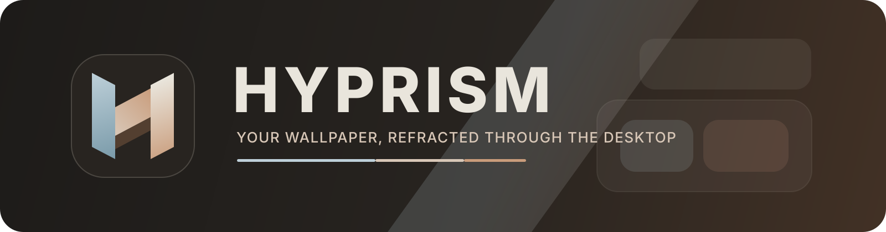
</p>

<h1 align="center">Hyprism</h1>

<p align="center">
  <strong>A cohesive, wallpaper-driven Hyprland desktop built with Quickshell.</strong>
</p>

<p align="center">
  <a href="https://archlinux.org/"></a>
  <a href="https://hypr.land/"></a>
  <a href="https://quickshell.org/"></a>
  <a href="https://github.com/InioX/matugen"></a>
</p>

## Table of contents

- [Overview](#overview)
- [Features](#features)
- [Preview](#preview)
- [Installation](#installation)
- [Requirements and support](#requirements-and-support)
- [Localization](#localization)
- [Configuration](#configuration)
- [`hyprism-shell`](#hyprism-shell)
- [Desktop widgets](#desktop-widgets)
- [Theming](#theming)
- [Essential keybindings](#essential-keybindings)
- [Project structure](#project-structure)
- [Contributing](#contributing)
- [Credits and licenses](#credits-and-licenses)

## Overview

Hyprism is an automated dotfiles environment for a personalized Hyprland session. Quickshell provides the morphing island, panels, notifications, and desktop widgets; Matugen turns the current wallpaper into one semantic palette shared throughout the desktop.

The project is intentionally opinionated. It manages a complete session rather than acting as a component library, while keeping personal choices such as language, weather, widget visibility, monitor placement, and appearance in one declarative configuration.

Hyprism `0.1.0` is an early public release designed around current Arch Linux and Wayland software. Expect the configuration and installation surface to continue evolving.

## Features

### Shell

- Compact and expanded island with workspaces, window context, status, battery, and media state.
- Hub with NetworkManager, Bluetooth, audio, brightness, power profiles, Do Not Disturb, notifications, media, and appearance controls.
- App Launcher, Clipboard, Emoji Picker, Wallpaper Picker, Power Menu, recording selector, OSD, notification popups, and history.
- Fast morphing transitions and focus-following keyboard navigation across interactive panels.

### Desktop

- Bento-style widgets for clock, weather, performance, network, storage, system information, sensors, services, tasks, processes, and media.
- Persistent per-widget controls through `hyprism-shell` and `user.json`.
- Hyprland configuration in Lua for monitors, workspaces, layouts, rules, gestures, keybindings, animations, and autostart.

### Theming

- Wallpaper-derived dark and light semantic palettes rather than independent static themes.
- Four light-palette temperature levels and optional scheduled light/dark switching.
- Coordinated output for Quickshell, Hyprland, Hyprlock, SDDM, GTK, Qt/Kvantum, Kitty, Foot, hyprtoolkit, Starship, tmux, Neovim, Fastfetch, and Zathura.
- Live palette updates for the running shell and supported terminal/toolkit applications.

### Utilities

- Native and Flatpak application indexing, Wayland portals, clipboard history, screenshots, monitor or region recording, color picking, session locking, and night mode.
- English and Brazilian Portuguese interfaces with live language switching.
- A stable user-facing CLI plus Makefile workflows for installation, updates, validation, reloads, and removal.

## Preview

[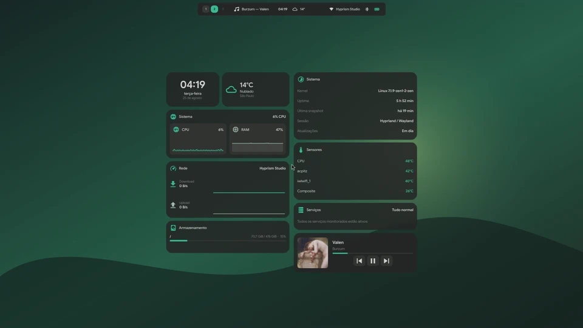](assets/demo/hyprism-tour.mp4)

Every comparison below shows the same interface in dark and light appearance with wallpaper-derived colors.

| Desktop and compact island | Expanded island |
| --- | --- |
| 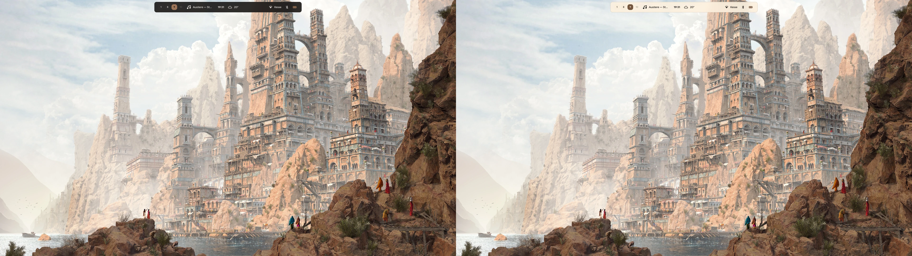 | 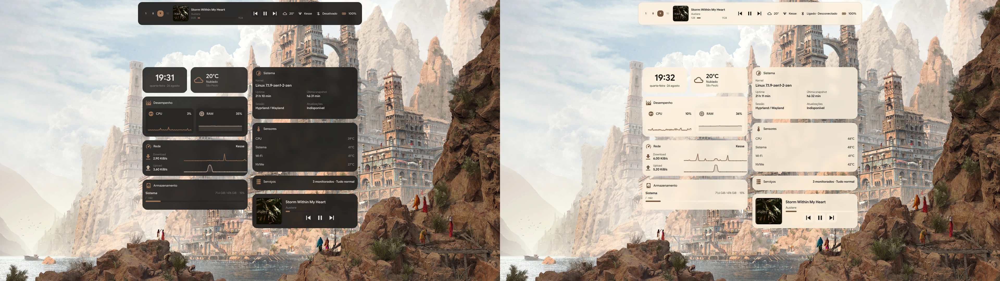 |
| **Desktop widgets** | **App Launcher** |
| 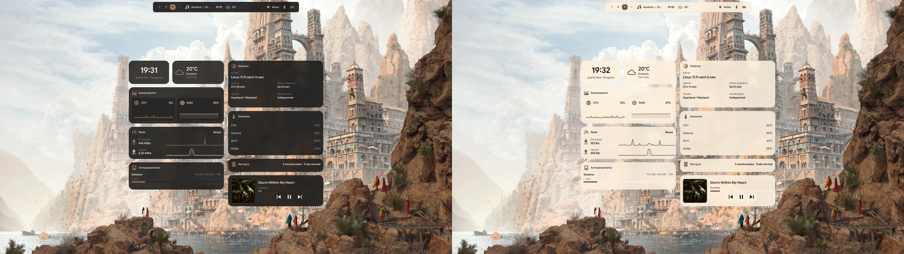 | 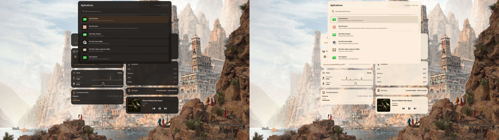 |
| **Hub** | **Notification history** |
|  | 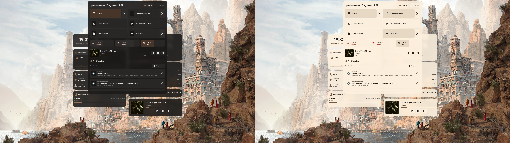 |
| **Network** | **Bluetooth** |
| 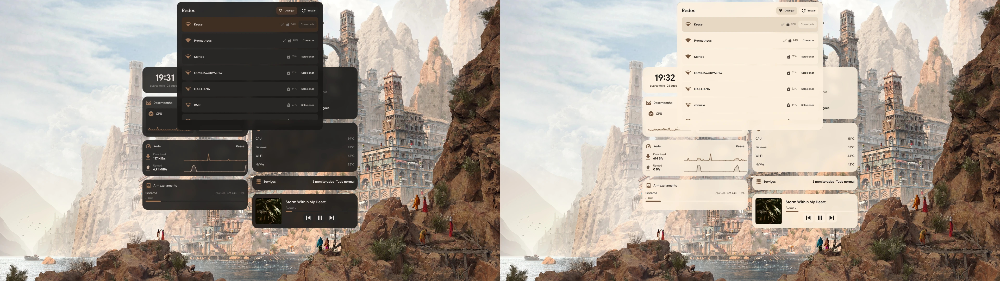 | 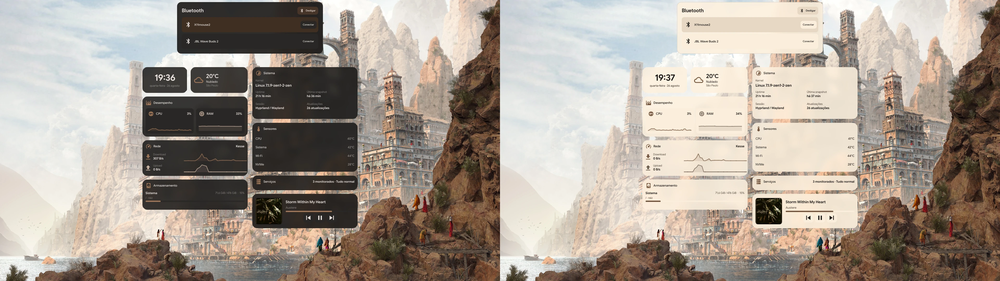 |
| **Clipboard** | **Emoji Picker** |
| 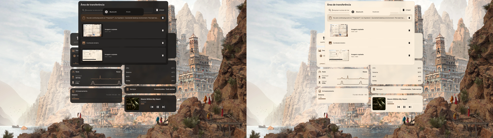 |  |
| **Power Menu** | **Screen Recording** |
| 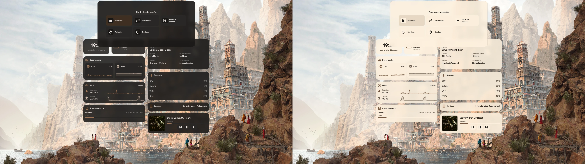 | 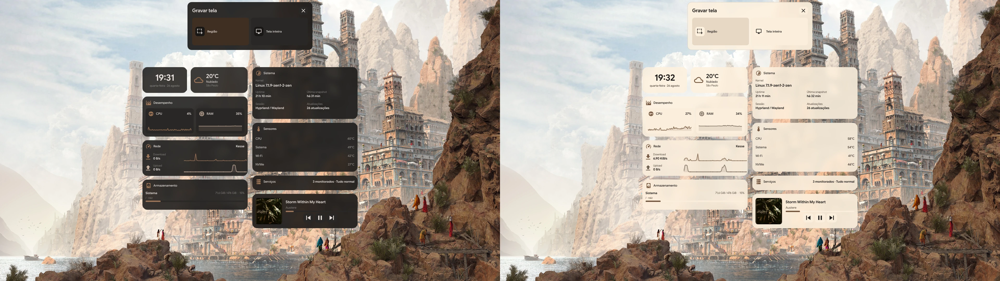 |
| **Wallpaper Picker** | **Light theme options** |
| 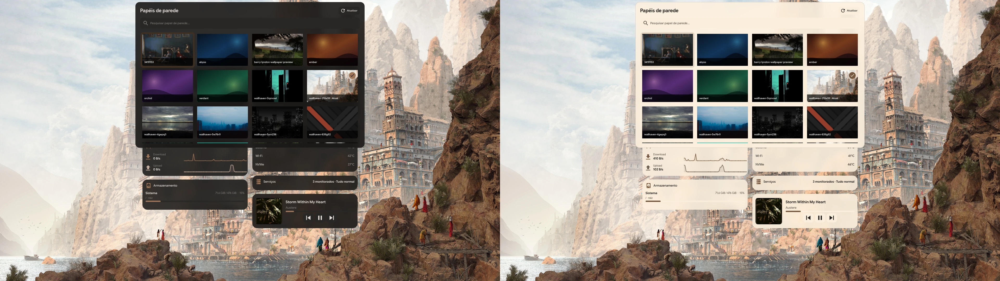 | 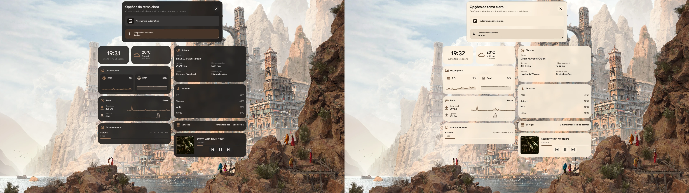 |

## Installation

Install the latest stable release from the AUR, then initialize the user configuration in English:

```bash
paru -S hyprism-shell
hyprism-shell init
```

Use `hyprism-shell init --lang pt-BR` for a new Brazilian Portuguese configuration. The initializer preserves existing user settings and unmanaged configuration paths.

The development package follows every commit on `main` and is intended for users who explicitly want unreleased changes:

```bash
paru -S hyprism-shell-git
hyprism-shell init
```

`paru` is only an example AUR helper. Both packages can also be cloned from the AUR and installed with the standard `makepkg -si` workflow.

For a repository-managed installation instead, clone Hyprism and run the installer directly:

```bash
git clone https://github.com/kristyancarvalho/hyprism.git
cd hyprism
make install
```

Install the interface in Brazilian Portuguese explicitly:

```bash
make install-ptbr
```

The equivalent variable form is `make install LANG=pt-BR`. Reapply an existing installation while preserving its language and user configuration with:

```bash
make update
```

Useful maintenance targets are available through `make help`. Run `make check` to validate the repository, `make reload` to reload Quickshell, and `make uninstall` to remove Hyprism-managed paths.

> [!WARNING]
> Installation provisions packages and replaces user paths managed by Hyprism. Conflicting paths are moved to `~/.local/state/hyprism/backups/` before links are created. Uninstallation archives the runtime and `user.json` under `~/.local/state/hyprism/uninstalled/`.

The AUR packages own immutable files under `/usr/share/hyprism` and `/usr/bin`. User preferences remain under `~/.config/hyprism` and are not removed with the package.

## Requirements and support

- Arch Linux with internet access during initial package provisioning.
- A regular user with package-installation privileges. The repository installer additionally uses `sudo` for packages, fonts, and SDDM configuration.
- Hardware and drivers suitable for a current Hyprland and Wayland session.
- A standard user `PATH` containing `~/.local/bin` after installation.

The installer and package lists target Arch Linux. Other distributions are not currently supported by the automated installation workflow. Hyprism owns a broad set of linked configuration paths and is best evaluated as a complete, opinionated desktop environment rather than layered over an unrelated dotfiles setup.

## Localization

English is the default for fresh installations. Brazilian Portuguese is available through `make install-ptbr` or `make install LANG=pt-BR`. Updates preserve a valid existing language choice.

The running interface can switch languages without a logout:

```bash
hyprism-shell language
hyprism-shell language set en
hyprism-shell language set pt-BR
```

Translations live in `config/quickshell/i18n/`. English is the canonical catalog and missing values fall back to English.

## Configuration

User preferences are stored in `~/.config/hyprism/user.json`. The installer migrates existing settings conservatively, while CLI mutations preserve unrelated values and replace the JSON atomically.

| Area | Important fields |
| --- | --- |
| Language | `language` |
| Appearance | `appearance.mode`, `appearance.whiteTemperature`, `appearance.schedule` |
| Keyboard | `keyboard.default`, `keyboard.devices.<identifier>` |
| User paths | `paths.wallpapers`, `paths.screenshots` |
| Shell placement | `shell.primaryMonitor`, `shell.widgetLayout` |
| Shell geometry | `shell.islandWidth`, `shell.compactHeight`, `shell.topMargin`, `shell.reserveGap` |
| Desktop widgets | `shell.widgets.<name>.enabled` and widget-specific options |
| Weather | `weather.location`, coordinates, timezone, and refresh interval |

Most routine changes are safer and easier through `hyprism-shell`; edit `user.json` directly only when configuring options not exposed by the CLI.

## `hyprism-shell`

The installer places `hyprism-shell` in `~/.local/bin`. Query commands produce concise output, invalid mutations return a non-zero status, and configuration writes are atomic.

```bash
hyprism-shell --help
hyprism-shell widgets list
hyprism-shell widgets toggle weather
hyprism-shell theme get
hyprism-shell theme toggle
hyprism-shell theme schedule set 07:00 18:30 --enable
hyprism-shell keyboard setup
hyprism-shell keyboard devices
hyprism-shell weather location "São Paulo"
hyprism-shell wallpaper random
hyprism-shell screenshot region
hyprism-shell open network
```

Hyprism does not assume a keyboard layout based on the device or connection type. It preserves detected system behavior unless an explicit override is saved. `hyprism-shell keyboard setup` provides an arrow-key setup and live preview that can be used even when typing commands with the current layout is inconvenient.

Manual theme selection disables automatic scheduling so the result is predictable. See the [complete CLI guide](docs/cli.md) for every command, valid widget identifier, schedule behavior, and shell action.

## Desktop widgets

Desktop widgets are separate from core shell functionality such as the island, Hub, launcher, and notification daemon. Available CLI identifiers are:

```text
clock weather media system network storage sensors uptime services tasks processes
```

Control one widget or the complete desktop-widget set:

```bash
hyprism-shell widgets disable network
hyprism-shell widgets enable network
hyprism-shell widgets toggle media
hyprism-shell widgets disable --all
hyprism-shell widgets enable --all
```

State is persisted in `shell.widgets` and survives shell reloads, appearance changes, wallpaper changes, and new sessions.

## Theming

Wallpaper color and appearance mode are inputs to one coordinated theme pipeline:

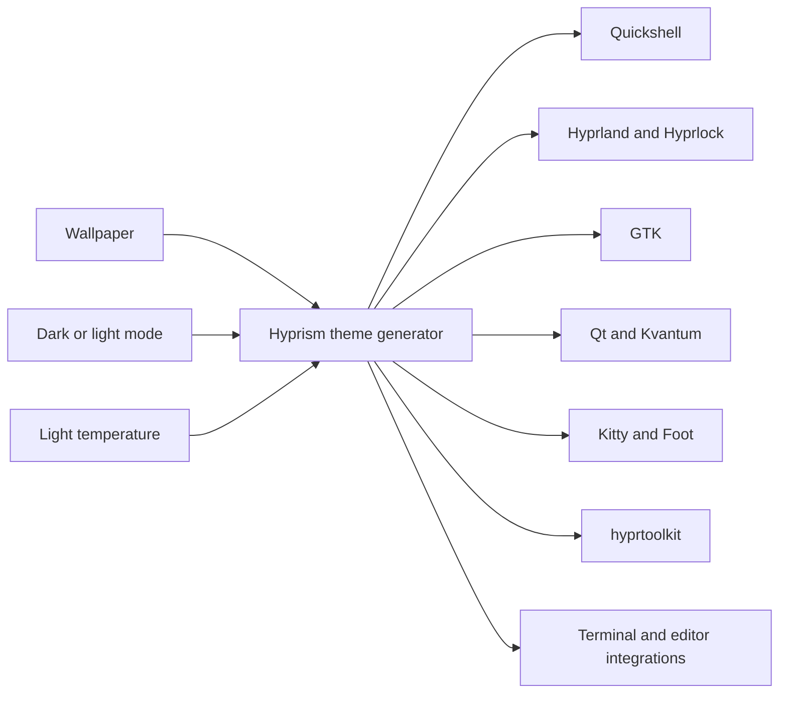

Changing wallpaper preserves the selected appearance. Changing appearance preserves the wallpaper. Dark mode is the default, automatic scheduling is opt-in, and light mode offers four temperature steps from neutral to amber.

## Essential keybindings

| Keybinding | Action |
| --- | --- |
| `Super+Return` | Open Kitty |
| `Super+R` | Open the App Launcher |
| `Super+Tab` / `Super+Shift+Tab` | Navigate windows; releasing `Super` confirms |
| `Super+K` / `Super+Alt+K` | Choose / randomize wallpaper |
| `Super+Shift+V` | Open the Clipboard |
| `Super+Shift+N` | Open the Network panel |
| `Ctrl+.` | Open the Emoji Picker |
| `Super+Shift+R` | Select or stop a recording |
| `Super+Shift+S` / `Super+Shift+F` | Capture a region / focused monitor |
| `Super+L` | Lock with Hyprlock |
| `Super+Ctrl+S` | Toggle night mode |
| `Super+B` | Open Zen Browser |
| `Super+1…0` | Go to workspaces 1–10 |

## Project structure

```text
.github/           Issue forms and pull request template
assets/            Branding, screenshots, and demo media
config/            Quickshell, Hyprland, toolkit, terminal, and application configuration
docs/              Focused user documentation
packages/          Manual installer package manifests
packaging/         Standalone AUR package recipes
scripts/           CLI, theme generation, services, and session utilities
tests/             Configuration and behavior validation
themes/            Managed session themes with upstream attribution
wallpapers/        Built-in fallback wallpapers
install.sh         Installation and migration workflow
uninstall.sh       Managed removal and archival workflow
Makefile           Project entry points
```

## Contributing

Use the structured [issue chooser](https://github.com/kristyancarvalho/hyprism/issues/new/choose) for reproducible bugs, feature requests, and installation problems. Remove credentials and personal data from logs or screenshots.

Before proposing a change:

```bash
make check
```

Keep changes focused, preserve English and PT-BR coverage for user-facing text, and include screenshots or video when behavior is visual. Pull requests receive a concise checklist automatically.

## Credits and licenses

Hyprism integrates projects including [Hyprland](https://hypr.land/), [Quickshell](https://quickshell.org/), [Matugen](https://github.com/InioX/matugen), [Colloid](https://github.com/vinceliuice/Colloid-gtk-theme), and [Papirus](https://github.com/PapirusDevelopmentTeam/papirus-icon-theme).

Hyprism's original code and documentation are available under the [MIT License](LICENSE), copyright Hyprism contributors.

Vendored and adapted components retain their attribution and licenses in their respective directories, including [KSDDM](themes/ksddm-hyprism/LICENSE) and [NvChad](config/nvim/LICENSE).
